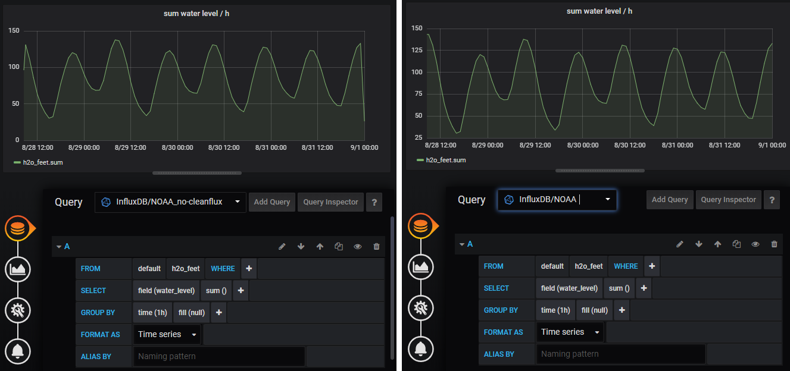
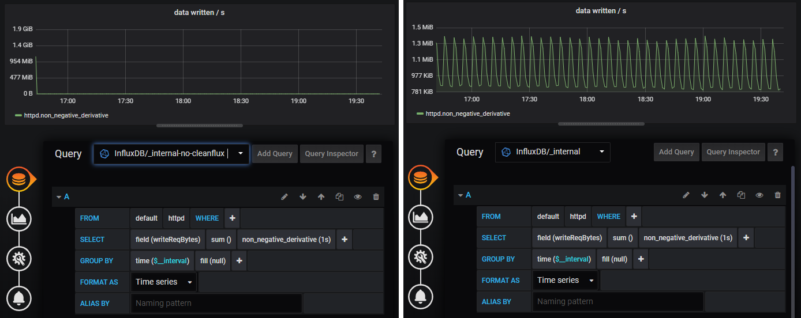

# Cleanflux

## Introduction

This project should ideally not exist and was created out of necessity.

Its acts as a proxy for an [InfluxDB](https://github.com/influxdata/influxdb) backend, sanitizing the output of strangely behaving InfluxQL queries.

Additionally, it features an automatic retention policy selection mechanism.

It works ideally between a [Grafana](https://grafana.com/) and an InfluxDB instance.

This was originally a fork of [trivago/Protector](https://github.com/trivago/Protector), an InfluxDB circuit breaker.
All the HTTP proxying code comes from this project, so kudos to them.

The project is build in Python (2.7) and expected to run on a [Miniconda](https://conda.io/miniconda.html) or [Anaconda](https://anaconda.org/) install.

Finally, I'm not a python expert, so don't be surprised to find all kinds of idiosyncrasies and anti-pythonic patterns.
Do not hesitate to submit pull request to propose correction to those.


## Features

### Automatic Retention Policy selection (issue #7198)

Automatic Retention Policy selection is implemented ([source](cleanflux/utils/influx/rp_auto_selection.py)).

This corrects this long standing limitation of InfluxDB that is tracked primarily in [issue #7198](https://github.com/influxdata/influxdb/issues/7198) (with interesting discussion in [issue #6910](https://github.com/influxdata/influxdb/issues/6910) and [issue #2625](https://github.com/influxdata/influxdb/issues/2625)).

Right now, schemas and their retention policies must be declared by hand in the configuration file.
It will only activate for queries targeting schemas declared this way.

It also only activates when no retention policy is explicitly defined in the query.

It will only work if fields names are kept the same across retention policies.

For queries that do a `GROUP BY time()`, the interval gets replaced if it corresponds to a higher precision that what the retention policy can offer.

Furthermore, we apply a ratio on values of `SUM() ... GROUP BY time()` queries that got a change of time interval, in order to preserve the rate unit.

Please note that queries with column like `sum(aaa) + ... + sum(zzz)` would have an incorrect ratio applied (only on last element would be scaled).

#### Example

For example, with the following [RPs](https://docs.influxdata.com/influxdb/latest/query_language/database_management/#retention-policy-management):

    > USE "my_app"
    Using database my_app
    > SHOW RETENTION POLICIES
    name    duration   shardGroupDuration replicaN default
    ----    --------   ------------------ -------- -------
    1_week  168h0m0s   1h0m0s             1        true
    3_month 2160h0m0s  24h0m0s            1        false
    10_year 87600h0m0s 168h0m0s           1        false

And the following [CQs](https://docs.influxdata.com/influxdb/latest/query_language/continuous_queries/):

    > CREATE CONTINUOUS QUERY cq_3_month_gauge ON "my_app" BEGIN SELECT mean(value) AS value INTO "my_app"."3_month".:MEASUREMENT FROM "my_app"."1_week"./^gauge_.*/ GROUP BY *, time(10m) END
    > CREATE CONTINUOUS QUERY cq_3_month_counter ON "my_app" BEGIN SELECT sum(value) AS value INTO "my_app"."3_month".:MEASUREMENT FROM "my_app"."1_week"./^counter_.*/ GROUP BY *, time(10m) END
    > CREATE CONTINUOUS QUERY cq_3_month_timer ON "my_app" BEGIN SELECT sum(count) AS count, mean(mean) AS mean, min(lower) AS lower, max(upper) AS upper, mean(stddev) AS stddev, mean("50_percentile") AS "50_percentile", mean("90_percentile") AS "90_percentile", mean("95_percentile") AS "95_percentile", mean("99_percentile") AS "99_percentile" INTO "my_app"."3_month".:MEASUREMENT FROM "my_app"."1_week"./^timer_.*/ GROUP BY *, time(10m) END
    > CREATE CONTINUOUS QUERY cq_10_year_gauge ON "my_app" BEGIN SELECT mean(value) AS value INTO "my_app"."10_year".:MEASUREMENT FROM "my_app"."3_month"./^gauge_.*/ GROUP BY *, time(1h) END
    > CREATE CONTINUOUS QUERY cq_10_year_counter ON "my_app" BEGIN SELECT sum(value) AS value INTO "my_app"."10_year".:MEASUREMENT FROM "my_app"."3_month"./^counter_.*/ GROUP BY *, time(1h) END
    > CREATE CONTINUOUS QUERY cq_10_year_timer ON "my_app" BEGIN SELECT sum(count) AS count, mean(mean) AS mean, min(lower) AS lower, max(upper) AS upper, mean(stddev) AS stddev, mean("50_percentile") AS "50_percentile", mean("90_percentile") AS "90_percentile", mean("95_percentile") AS "95_percentile", mean("99_percentile") AS "99_percentile" INTO "my_app"."10_year".:MEASUREMENT FROM "my_app"."3_month"./^timer_.*/ GROUP BY *, time(1h) END

Configuration should follow this syntax:

    aggregation_properties:
      my_awesome_schema:
        - regexp: 'timer_.*'
          function: sum
        - regexp: 'counter_.*'
          function: sum
        - regexp: 'gauge_.*'
          function: mean

    retention_policies:
      my_awesome_schema:
        - name: 1_week
          duration: 168h0m0s
          default: true
          interval: 10s
        - name: 3_month
          duration: 2160h0m0s
          interval: 10m
        - name: 10_year
          duration: 87600h0m0s
          interval: 3h

The `interval` fields are optional and correspond to the interval between 2 points, i.e. the precision of the measurements.

For `SUM() ... GROUP BY time()`, in order to apply the correct ratio, Cleanflux needs to know the function used for downsampling (either `sum` or `mean`).
This function is defined in the downsampling configuration (via [CQs](https://docs.influxdata.com/influxdb/latest/query_language/continuous_queries/), [Kapacitor](https://docs.influxdata.com/kapacitor/latest/)...).

This is why we need to declare it in the `aggregation_properties` section.

Default rules can be specified with the special `default` schema name:

    aggregation_properties:
      default:
        - regexp: 'timer_.*'
          function: sum
        - regexp: 'counter_.*'
          function: sum
        - regexp: 'gauge_.*'
          function: mean


#### About InfluxDB Retention Policy Intervals

When defining an InfluxDB retention policy, you must prec
a retention duration interval.

To maximize the rendered precision, we recommend intervals that match Grafana predefined ranges.

For example:

    CREATE RETENTION POLICY "3_month" ON my_schema DURATION 90d REPLICATION <n>;
    CREATE RETENTION POLICY "1_year" ON my_schema DURATION 365d REPLICATION <n>;
    CREATE RETENTION POLICY "10_year" ON my_schema DURATION 3650d REPLICATION <n>;

### Automatic Reduction of Precision for Large Time Intervals

To optimize InfluxDB response times and Grafana rendering, Cleanflux has a mechanism to automatically downgrade the requested precision of queries for large time intervals.

There are 2 supported implementations.

#### Lightweight

The first and most lightweight downsamples according to an estimate of the number of points the query would return for 1 series.

It is better suited for when we know the max expected number of series any queries can produce.

Configuration:

    max_nb_points_per_series: 1000
    max_nb_points_per_query:

This should be set in accordance with the `max-row-limit` parameter in InfluxDB configuration.
For example for a `max-row-limit` of 300000 and a `max_nb_points_per_series` of 1000, results would start to get truncated at the 301st series (1 + 300k / 1k).

#### Accurate

The other mode is more accurate, by doing a first request towards InfluxDB to get the number of series.

This first request adds a time overhead.

Configuration:

    max_nb_points_per_series:
    max_nb_points_per_query: 300000

We can configure it with the same value as the `max-row-limit` parameter in InfluxDB configuration.


### Removal of Partial Intervals case `SUM() ... GROUP BY time()` (issues #8010 & #6451)

Solves issue listed in [issue #8010](https://github.com/influxdata/influxdb/issues/8010) (see also [Grafana issue #5961](https://github.com/grafana/grafana/issues/5961)).



As a positive side-effect, it also corrects [issue #6451](https://github.com/influxdata/influxdb/issues/6451).



The code can be found in file [remove_partial_intervals_case_sum_group_by_time.py](cleanflux/corrective_rules/remove_partial_intervals_case_sum_group_by_time.py)

This corrects points corresponding to partial intervals when using `SUM()` along with `GROUP BY time()`.

Moreover, it shifts forwards the time indexes of the result sets by one group by interval.
Indeed, InfluxDB's behaviour is to make the SUM over the following interval and not the previous one!

Furthermore, (as of InfluxDB 1.1.1) the secondary argument for the `GROUP BY time()` clause doesn't work when corresponding to a delta superior to the group by time interval.

Please note that it might not work properly for queries with the time boundaries WHERE clause is surrounded by parenthesis.


## Configuration

An example configuration file at [conf.example.yml](conf.example.yml).

In the rest of this documentation, it is assumed that it gets deployed at `/etc/cleanflux.yml`.


## Running

### Python Virtual Env Instantiation

A *virtual env* (*venv* for short) allows to install packages only for the scope of a project.

It is recommended to instantiate one *venv* per project, to prevent conflicts between dependencies versions.

#### Conda Env

When using Miniconda or Anaconda, we rely on a *conda env* instead fo a standard *virtual env*.

Instead, we rely on the more modern environment.yml file.
The env name is defined in this file.

To instantiate the conda env for the project, in a shell placed in the project root directory:

    $ conda env create

#### Classic Virtual Env

Once you have created the virtual env, install dependencies by:

    pip install -r requirements_pip.txt

### Manual Launch

With venv active and inside root of the project source:

    $ python cleanflux -c /etc/cleanflux.yml --foreground

### LSB Service Script

The following has been tested on Debian with miniconda, cleanflux sources being deployed in `/opt/cleanflux`.

Create file `/etc/init.d/cleanflux`:

```bash
#!/bin/bash
### BEGIN INIT INFO
# Provides:          cleanflux
# Required-Start:    $all
# Required-Stop:
# Default-Start:     2 3 4 5
# Default-Stop:
# Short-Description: Proxy to ease communicating w/ an InfluxDB instance
### END INIT INFO

CLEANFLUX_CONF=/etc/cleanflux.yml
CLEANFLUX_VENV=/usr/local/anaconda/envs/cleanflux-env

DAEMON_PATH="/opt/cleanflux"
DAEMON="$CLEANFLUX_VENV/bin/python cleanflux -c $CLEANFLUX_CONF"
NAME=cleanflux

SCRIPTNAME=/etc/init.d/$NAME

case "$1" in
    start)
	    cd $DAEMON_PATH
	    $DAEMON start
	    exit $?
	    ;;
    status)
        cd $DAEMON_PATH
        $DAEMON status
        exit $?
        ;;
    stop)
        cd $DAEMON_PATH
        $DAEMON stop
        exit $?
        ;;
    restart)
        cd $DAEMON_PATH
        $DAEMON restart
        exit $?
        ;;
    *)
        echo "Usage: $0 {status|start|stop|restart}"
        exit 1
esac

exit 0
```

## Implementation Details

### Query Parsing

We do a lot of the [query parsing](cleanflux/utils/influx/query_sqlparsing.py) and [modification](cleanflux/utils/influx/query_modification.py) via library [sqlparse](https://github.com/andialbrecht/sqlparse) and use of regular expressions.

Library `sqlparse` seems to be kinda slow (at least for InfluxQL queries).


### Logging

This app can log either to a custom file:

    use_syslog: False
    logfile: /var/log/cleanflux.log

Or to syslog:

    use_syslog: true

When using syslog, one can log to the local syslog instance or to a remote one:

    syslog_address: <address>

Please note that stack traces are logged.

### Metrics

Cleanflux can produce metrics in [Datadog StatsD format](https://docs.datadoghq.com/developers/dogstatsd/?tab=python) using the [datadog](https://datadogpy.readthedocs.io/en/latest/) python module.
This derived protocol allows meta-data (_"tags"_) to be transmitted alongside the values.

To enable the collection of those metrics put this in config.yml:

    statsd_host: localhost
    statsd_port: 8125

We recommend collecting those metrics using the [StatsD input plugin for Telegraf](https://github.com/influxdata/telegraf/tree/master/plugins/inputs/statsd).

Don't forget to enable the following flag:

    parse_data_dog_tags = true


## Development Environment

This project was made using IntelliJ IDEA.

At the time of writing, IntelliJ IDEA / Pycharm have limited support for conda envs.

So you could either:
 - use a default python venv (with file requirements.txt)
 - use a conda env but instantiate it in CLI

If using option #2, you can then bind the conda env with IntelliJ:
 - `Project Structure > Platform Settings > SDK ` (`Control-Alt-Shift + S`).
 - Click the `+` button, then select `Python SDK` from the dop down list.
 - Select the python executable for your env.

   Under windows, it would be at location like `C:\ProgramData\Anaconda2\envs\<env-name>\python.exe`.
 - Associate the env to the project, by going to menu `Project Structure > Project Settings > Project > Project SDK` and selecting it from the drop-down list.


## Known Limitations

This won't run under Microsoft Windows. Indeed, we rely on [daemonocle](https://pypi.python.org/pypi/daemonocle) that is linux-only.

This has not been tested and should not work (yet) with nested queries.

URL request parameters `epoch`, `chunked` and `pretty` are not (yet) supported.

No support for parsing user and password from basic authentication request.


## Similar Projects

Obviously, [trivago/Protector](https://github.com/trivago/Protector) is a major source of inspiration.

Automatic Retention Policy selection has also been implemented by [Lupul/influxdb-grafana-rp-proxy](https://github.com/Lupul/influxdb-grafana-rp-proxy).
